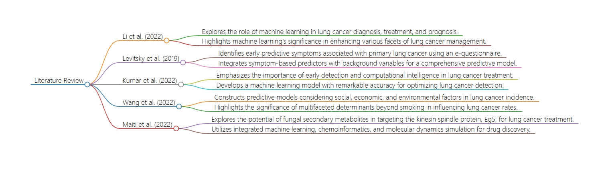

# Literature Review
### Introduction
- My research of lung cancer prediction through machine learning techniques is paramount in modern healthcare, offering promising avenues for early detection and intervention. Leveraging environmental and lifestyle variables, this research aims to develop predictive models that can accurately assess lung cancer risk. By integrating data on factors such as smoking habits, air pollution exposure, dietary patterns, and occupational hazards, this investigation seeks to enhance our understanding of the complex interplay between individual behaviors and environmental influences on lung cancer development. Through a comprehensive literature review, this study aims to consolidate existing knowledge and identify gaps, laying the groundwork for the development of robust predictive algorithms with significant implications for public health and personalized medicine.
## Literature
### In this part, I will summarize the related literature and exaplain how it contributes to my own research.
- Li et al. (2022) explores the pivotal role of machine learning techniques in advancing the diagnosis, treatment, and prognosis of lung cancer amidst the abundance of data generated by imaging and sequencing technologies. By systematically integrating and analyzing these vast datasets, machine learning methods offer significant enhancements in various facets of lung cancer management, encompassing early detection, auxiliary diagnosis, prognosis prediction, and guiding immunotherapy practices. The review underscores the challenges and opportunities in the application of machine learning in lung cancer research and clinical practice. This paper is highly relevant to my own research endeavor as it elucidates the indispensable contribution of machine learning in leveraging complex datasets to predict lung cancer levels, aligning with my aim to develop predictive models based on environmental and lifestyle variables.
- Levitsky et al. (2019) aimed to identify a combination of early predictive symptoms and sensations associated with primary lung cancer (LC) by administering an interactive e-questionnaire to patients referred for suspected LC. Through meticulous analysis and modeling using orthogonal projections to latent structures (OPLS), 63 descriptors were identified as the most significant predictors of LC, including variations in cough throughout the day, back pain, early satiety, appetite loss, and reduced strength. Combining these descriptors with background variables such as smoking status, recent respiratory illnesses, sex, age, and history of chronic obstructive pulmonary disease (COPD) resulted in a comprehensive predictive model with promising accuracy. This research contributes valuable insights into early symptomatology associated with LC, potentially aiding in referral and diagnostic decision-making. Unlike my own research focusing on environmental and lifestyle variables, this study offers insights into early symptoms that could complement predictive models for lung cancer risk assessment and detection. Incorporating such symptom-based predictors alongside environmental factors may provide a more comprehensive approach to lung cancer prediction.
- This paper underscores the urgent need for early detection of lung cancer, the leading cause of cancer-related mortality, and highlights the potential of computational intelligence to construct sustainable prototype models for its treatment without environmental harm. By leveraging support vector machines (SVMs) and Python programming, a machine learning model was developed to optimize the detection process using lung cancer datasets. The effectiveness of the SVM model was evaluated against various criteria, demonstrating a remarkable accuracy rate of 98.8% compared to existing methods. This research not only emphasizes the importance of leveraging computational tools for efficient healthcare delivery but also signifies a departure from manual approaches, potentially saving significant time, money, and resources. While my research focuses on predicting lung cancer levels based on environmental and lifestyle variables, this paper's emphasis on utilizing computational intelligence complements my approach by providing insights into advanced technological methodologies for early detection and treatment optimization in lung cancer management.
- Kumar et al. (2022). underscores the urgent need for early detection of lung cancer, the leading cause of cancer-related mortality, and highlights the potential of computational intelligence to construct sustainable prototype models for its treatment without environmental harm. By leveraging support vector machines (SVMs) and Python programming, a machine learning model was developed to optimize the detection process using lung cancer datasets. The effectiveness of the SVM model was evaluated against various criteria, demonstrating a remarkable accuracy rate of 98.8% compared to existing methods. This research not only emphasizes the importance of leveraging computational tools for efficient healthcare delivery but also signifies a departure from manual approaches, potentially saving significant time, money, and resources. While my research focuses on predicting lung cancer levels based on environmental and lifestyle variables, this paper's emphasis on utilizing computational intelligence complements my approach by providing insights into advanced technological methodologies for early detection and treatment optimization in lung cancer management.
- Wang et al. (2022) addresses the pressing public health concern of lung cancer by adopting a comprehensive approach that integrates social, economic, and environmental dimensions often overlooked in previous studies. By considering a range of risk factors such as air pollution, tobacco use, socioeconomic status, and environmental factors, the study constructs predictive models using various machine learning algorithms. Notably, the cubist model tree emerges as the most effective model in predicting lung cancer incidence rates, demonstrating its utility in precise analysis and estimation. The findings highlight the significance of factors beyond smoking, such as NO2 concentration and employment percentage, in influencing lung cancer incidence. While my research primarily focuses on predicting lung cancer levels based on environmental and lifestyle variables, this study's holistic perspective and utilization of advanced predictive modeling techniques offer valuable insights into the multifaceted determinants of lung cancer, potentially enhancing the accuracy and comprehensiveness of predictive models in my own research.
- Maiti et al. (2022) explores the potential of fungal secondary metabolites from the Indian Himalayan Region (IHR) in targeting the kinesin spindle protein, Eg5, implicated in various cancers including lung cancer. Employing integrated machine learning, chemoinformatics-based in silico screening, and molecular dynamics simulation, the study identifies four mycotic secondary metabolites—(−)-Cochlactone-A, Phelligridin C, Sterenin E, and Cyathusal A—with promising binding potential to Eg5 and demonstrated cytotoxicity against lung cancer cell lines. The comprehensive approach utilized in this study, incorporating predictive modeling, molecular docking, and simulation techniques, offers a novel strategy for identifying potential drug candidates against lung cancer. This research diverges from my own article, which focuses on predicting lung cancer incidence rates based on environmental and lifestyle variables, by emphasizing the exploration of fungal secondary metabolites as potential therapeutic agents targeting specific molecular pathways implicated in cancer progression.

## Flowchart

source: Markmap.js

## Reference
- Anil Kumar, C., Harish, S., Ravi, P., SVN, M., Kumar, B. P. P., Mohanavel, V., Alyami, N. M., Priya, S. S., & Asfaw, A. K. (2022). Lung cancer prediction from text datasets using machine learning. BioMed Research International, 2022, 6254177-10. https://doi.org/10.1155/2022/6254177
- Levitsky, A., Pernemalm, M., Bernhardson, B., Forshed, J., Kölbeck, K., Olin, M., Henriksson, R., Lehtiö, J., Tishelman, C., & Eriksson, L. E. (2019). Early symptoms and sensations as predictors of lung cancer: A machine learning multivariate model. Scientific Reports, 9(1), 16504. https://doi.org/10.1038/s41598-019-52915-x
- Li, Y., Wu, X., Yang, P., Jiang, G., & Luo, Y. (2022). Machine learning for lung cancer diagnosis, treatment, and prognosis. Genomics, Proteomics & Bioinformatics, 20(5), 850-866. https://doi.org/10.1016/j.gpb.2022.11.003
- Maiti, P., Sharma, P., Nand, M., Bhatt, I. D., Ramakrishnan, M. A., Mathpal, S., Joshi, T., Pant, R., Mahmud, S., Simal-Gandara, J., Alshehri, S., Ghoneim, M. M., Alruwaily, M., Awadh, A. A. A., Alshahrani, M. M., & Chandra, S. (2022). Integrated machine learning and chemoinformatics-based screening of mycotic compounds against kinesin spindle ProteinEg5 for lung cancer therapy. Molecules (Basel, Switzerland), 27(5), 1639. https://doi.org/10.3390/molecules27051639
- Wang, K., Chen, K., Hernanda, C. A., Tseng, S., & Wang, K. (2022). How is the lung cancer incidence rate associated with environmental risks? machine-learning-based modeling and benchmarking. International Journal of Environmental Research and Public Health, 19(14), 8445. https://doi.org/10.3390/ijerph19148445
  
